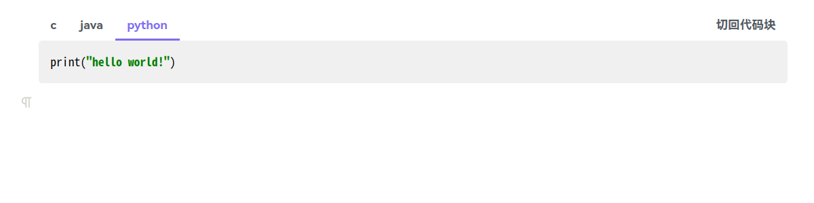

# Siyuan Code Tabs

[中文版](./README_zh_CN.md)
## Introduction
Siyuan plugin that allows you to put code in multiple languages under a set of tabs

## Example
1. Insert a code-block into a SiYuan document with the following content and formatting
```
tab:c
#include<stdio.h>
int main(){
    printf("hello world\n");
    return 0;
}
tab:java
public class HelloWorld {
    public static void main(String[] args) {
        System.out.println("Hello World");
    }
}
tab:python
print("hello world")
```

2. Click the block menu in the upper left corner of the code-block -> Plugin -> Convert code-block to tabs
   
   
   
   

3. If you need to edit the code, click the block menu in the upper-left corner of the block -> Plugins -> `toggle to code-block`, and then convert the code-block to a tab again after editing is complete
   

4. You can also use click the block menu in the upper-left corner of the block -> Plugins -> `Update all code-tabs in current document` to quickly update the style of the code-tabs in the document to the current theme style

## Comment
- I haven't had much exposure to frontend technologies. Essentially, this plugin was written with the help of Wenxin Yiyán and ChatGPT. If no serious bugs arise, the update frequency should be quite low.
- This plugin was developed following the example of [obsidian-code-tab](https://github.com/lazyloong/obsidian-code-tab)