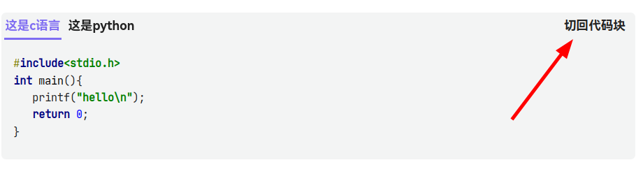

# Siyuan Code Tabs

[中文版](./README_zh_CN.md)
## Introduction
Siyuan plugin that allows you to put code in multiple languages under a set of tabs

## Known Issues
- If the code block contains angle brackets `< >`, restarting or rebuild index may cause the code in the tab to display abnormally. You need to switch the tab back to the code block and then reconvert it to the tab. For details, see [Issue #11321 - siyuan-note/siyuan](https://github.com/siyuan-note/siyuan/issues/11321). If there are multiple code-tabs in the document, you can also quickly fix the errors by click the block menu in the upper-left corner of any block -> Plugin -> `Update all code-tabs in current document`.
- All code-tabs styles are lost when exporting a document, so the plugin can only be used inside Siyuan Notes.
- The background of the code-tabs may need to be rebuild index or restarted to change after changing the theme.

## Tips
- 3.0.12 and above need to turn on `Allow execution of scripts within HTML blocks` in Settings -> Editor.
- v0.1.0 is not compatible with previous versions, previously generated code tabs need to be deleted.

## Example
1. Insert a code-block into a SiYuan document with the following content and formatting
   ```
   tab:c
   #include<stdio.h>
   int main(){
      printf("hello world\n");
      return 0;
   }
  
   tab:java
   public class HelloWorld {
      public static void main(String[] args) {
         System.out.println("Hello World");
      }
   }
  
   tab:python
   print("hello world")
   ```
   

2. Click the block menu in the upper-left corner of the code-block -> Plugin -> Convert code-block to tabs
   
   

3. If you need to edit the code, you can click on "Toggle to code-block" in the upper-right corner of the tab. After editing, convert the code block back to code-tabs again.
   

## Comment
- I haven't had much exposure to frontend technologies. Essentially, this plugin was written with the help of Wenxin Yiyan  and ChatGPT. If no serious bugs arise, the update frequency should be quite low.
- This plugin was developed following the example of [obsidian-code-tab](https://github.com/lazyloong/obsidian-code-tab)