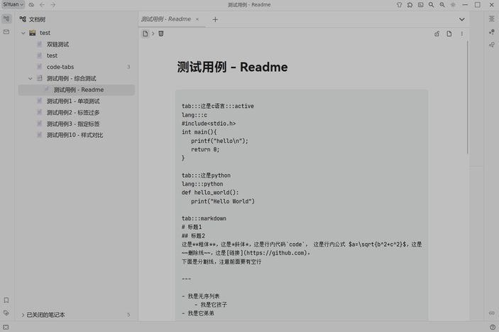
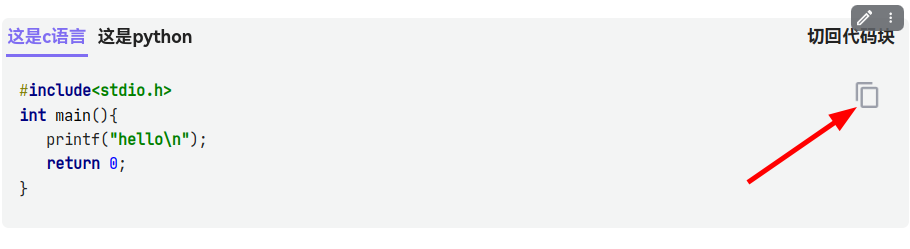

# Siyuan Code Tabs

[中文版](./README_zh_CN.md)

## Introduction

Siyuan plugin that allows you to put code in multiple languages under a set of tabs

## Known Issues

- Unable to adapt to all third-party themes.
- There must be at least one open document when changing theme or mode, otherwise the style of the code-tabs won't
  change with the theme, and you need to open a document and then change theme again.
- When exporting to markdown or html, all the code-tabs styles will be lost, only when exporting pdf or image can the
  code-tabs be displayed normally.
- The style of the code-tabs may appear abnormally when switching themes, then please try the following methods:
    - change appearance mode
    - change theme
    - Close document and reopen it
    - Try the above method again after restarting SiYuan Notes
- ***Only SiYuan 3.0.16 and above can be used normally***

## Tips

- 3.0.14 and above need to turn on `Allow execution of scripts within HTML blocks` in Settings -> Editor.
- Since version 0.3.0, all functions have basically achieved the expected goals (temporarily not considering the
  implementation of the `Code block line number`). Future updates will mainly focus on bug fixes and style
  optimizations.
- **After updating the plugin, if there is a display exception, you can
  use `Plugins -> Fix all code-tabs in opened documents` to fix it. If you still have problems, try regenerating the
  code-tabs after `toggle to code-block`**

## Example

1. Insert a code block in the SiYuan document as follows. Enter the title after `tab:::`, and then add `:::active` to
   indicate that this tab is activated by default when the document is opened. If this flag(`:::active`) is not added,
   the first tab is activated by default. Enter the language after `lang:::`. If "lang:::language" is omitted, the title
   is used as the default language for the code. [Example file](./asset/example.md)
    - When the language is `markdown`, [marked](https://github.com/markedjs/marked) will be used for rendering.
      Rendering [Katex formulas](https://katex.org)
      with [marked-katex-extension](https://github.com/UziTech/marked-katex-extension), Rendering code blocks
      with [marked-highlight](https://github.com/markedjs/marked-highlight).
   ```
   tab:::this is c
   lang:::c
   #include<stdio.h>
   int main(){
   printf("hello\n");
   return 0;
   }
   
   tab:::python:::active
   def hello_world():
   print("Hello World")
   ```

2. Click the block menu in the upper-left corner of the code-block -> Plugin -> Convert code-block to tabs, you can also
   set a shortcut key for this function in Settings -> Keymap.
   

3. If you need to edit the code, you can click on "Toggle to code-block" in the upper-right corner of the tab. After
   editing, convert the code block back to code-tabs again.
   
4. You can copy the code in one click by clicking the copy button in the upper right corner(Copy plaintext only).  
   
5. If there are too many tabs, some of the tabs will be hidden, in the desktop application, you can put the mouse cursor
   on the tabs bar and use the mouse wheel to scroll through them, and in the mobile application, you can slide the tabs
   bar left and right to view them.
6. Demo.  
   

## Comment

- Essentially, this plugin was written with the help of Wenxin Yiyan and ChatGPT.
- This plugin was developed following the example of [obsidian-code-tab](https://github.com/lazyloong/obsidian-code-tab)
- The version of SiYuan Notes at the time of testing: 3.1.13

## Changelog

### v0.6.2

- Fix missing line breaks when "Toggle to code-block".
- Adjust spacing between tags and code in some themes.

### v0.6.1

- Adjust the minimum width of the tag.

### v0.6.0

- Copy button can now copy markdown.
- Swipe left or right to view tags when there are too many tags on mobile.
- Fixed the problem that the copy button doesn't work when using docker.
- Optimize tag style.

### v0.5.0

- Optimize the display effect and adapt more themes.
- Fix display anomalies when using docker that may be caused by CORS issues.
- Fix padding being too small.

### v0.4.2

- Support for docker.

### v0.4.1

- The plugin checks if the Allow execution of scripts within HTML blocks is turned on when it loads.

### v0.4.0

- Fix the problem of escaping pointed brackets.
- Limit the length of tab title and add horizontal scroll bar automatically when there are too many tabs.
- Adjust the font size of plaintext and code blocks in markdown.

### v0.3.0

- Optimize CSS display effects.
- Adapt the code-tabs to support more themes.
- Now you can specify the default active tab when the document is opened.
- Fixed a few bugs.