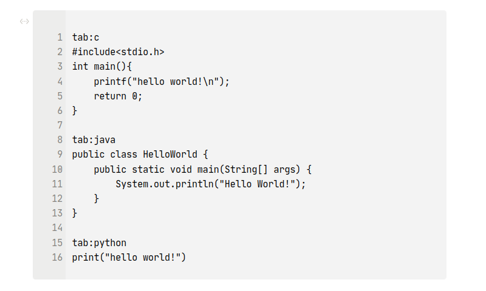
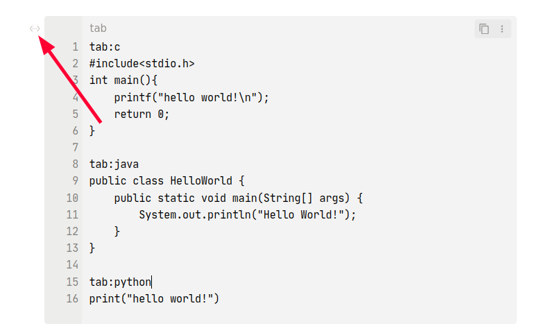
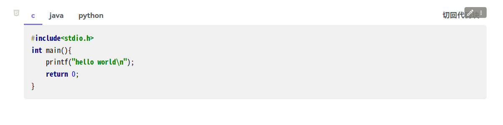

# Siyuan Code Tabs

[English](./README.md)
## 简介
这个思源插件允许你将多种语言的代码放在一组标签页下

## 已知问题
- 如果代码块中包含尖括号`<>`，重启或重建索引会导致标签页中的代码显示异常，需要将标签页切换回代码块后重新转换为标签页，详情见[Issue #11321 · siyuan-note/siyuan](https://github.com/siyuan-note/siyuan/issues/11321)，如果文档中代码标签页比较多，也可以通过任意块左上角的块菜单 -> 插件 -> 更新当前文档所有标签页 快速修复代当前文档中代码块标签页的错误
- 目前导出文档时所有标签页样式都会丢失，所以插件只能在思源笔记内部使用
- 标签页的背景在更改主题样式后可能需要重建索引或重启才能变化

## 提示
- 思源3.0.12及以上版本需要在 设置 -> 编辑器 中打开 `允许执行HTML块内脚本`
- 0.1.0版本与之前的版本不兼容，以前生成的代码标签页需要删除

## 使用示例
1. 先在思源文档中插入一个代码块，内容及形式如下所示，在`tab:`后输入代码语言，之后再输入代码
   ```
   tab:c
   #include<stdio.h>
   int main(){
     printf("hello world!\n");
     return 0;
   }

   tab:java
   public class HelloWorld {
     public static void main(String[] args) {
         System.out.println("Hello World!");
     }
   }
   
   tab:python
   print("hello world!")
   ```
   
2. 鼠标点击代码块左上角的块菜单 -> 插件 -> 将代码块转换为标签页，效果如下
   
   

3. 若需要编辑代码，可点击标签页右上角的 **切回代码块**，编辑完成之后再次将代码块转换为标签页即可
   

## 备注
- 没怎么接触过前端技术，这个插件基本上是在文心一言和ChatGPT的帮助下写出来的，后续如果没有重大错误更新频率会比较低。
- 这个插件是仿照[obsidian-code-tab](https://github.com/lazyloong/obsidian-code-tab)写的