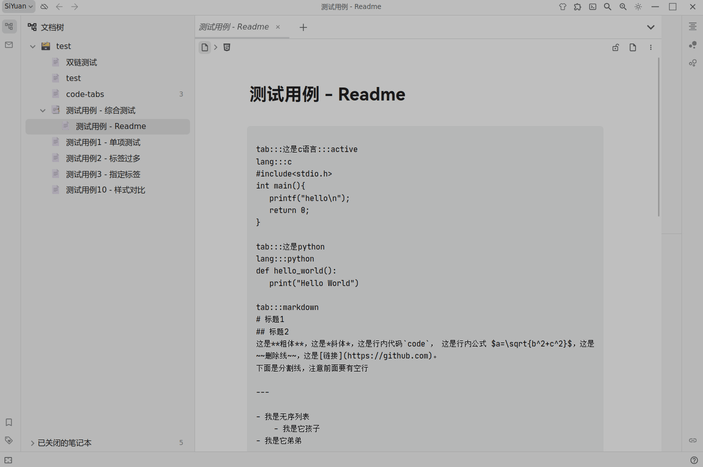
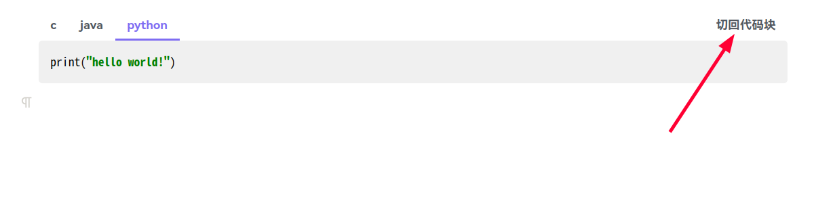
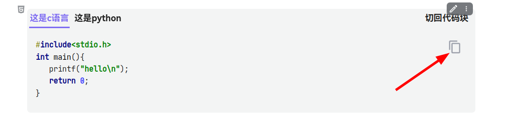

# Siyuan Code Tabs

[English](./README.md)

## 简介

这个思源插件允许你将多种语言的代码放在一组标签页下，为你的代码展示提供更优雅的解决方案。通过简洁的语法，你可以轻松创建带有标签页的代码块，支持多种编程语言。

## 已知问题

- 不保证适配所有第三方主题
- 切换主题或模式时至少要有一个打开着的文档，否则标签页样式不会随主题改变，需要打开一个文档后再次切换主题
- 导出为markdown或html等格式时所有标签页样式会丢失，只有导出pdf或图片时标签页才能正常显示，且无法切换标签页
- 更换主题时代码标签页的样式可能会出现异常，这时请尝试以下方法：
    - 切换外观模式
    - 切换主题
    - 关闭已打开的文档再重新打开
    - 重启思源笔记后再次尝试以上方法
- ***目前仅3.5.0及以上版本可正常使用***

## 提示

- 需要在 设置 -> 编辑器 中打开 `允许执行HTML块内脚本` 后插件才能正常运行
- 0.7.0 版本进行了重大重构，之前大量使用此插件的用户建议先测试无问题后再正式更新使用
- **更新插件后如果出现显示异常，可尝试切回代码块后重新生成代码标签页**

## 使用示例

1. 先在思源文档中插入一个代码块，形式如下。使用 `:::` 作为开头，后面接 `标题 | 语言 | active` 的格式。
   其中 `active` 表示打开文档时默认激活这个标签，若没有添加该标志则默认激活第一个标签。
   语言参数可选，如果省略会将标题作为代码的语言类型。[示例文件](./asset/example.md)
    - 语言类型为`markdown`时会使用[marked](https://github.com/markedjs/marked)
      进行渲染，使用[marked-katex-extension](https://github.com/UziTech/marked-katex-extension)
      渲染[Katex](https://katex.org/)公式，使用思源自带的 hljs 渲染代码块。
   ```
   ::: 这是c语言 | c | active
   #include<stdio.h>
   int main(){
      printf("hello\n");
      return 0;
   }
   
   ::: python
   def hello_world():
      print("Hello World")
   ```
2. 鼠标点击 代码块左上角的块菜单 -> 插件 -> `块：代码块 -> 标签页`，你也可以在 设置 -> 快捷键
   中为该功能设置一个快捷键，转换后效果如下。块菜单中的另外两个功能是基于当前文档进行批量转换和还原。  
   
3. 若需要编辑代码，可点击标签页右上角的 **切回代码块**，编辑完成之后再次将代码块转换为标签页即可
   
4. 可以点击右上角的复制按钮一键复制代码  
   
5. 标签过多时一部分标签会被隐藏，桌面端可以将鼠标光标放在标签栏上使用鼠标滚轮滚动查看，移动端可以左右滑动标签栏查看
6. 效果演示  
   
7. 由于第三方主题过于复杂，0.7.0版本增加了一个自定义配置文件，可以让用户自行适配需要使用的主题，配置文件的路径在`SiYuan工作空间/data/plugins/code-tabs/custom/theme-adaption.yaml`，仿照其中的示例并配合使用开发者工具即可完成对主题的适配。也可以将自己适配好的主题提交 pr 到本仓库，仓库中适配文件的路径为 `/public/asset/theme-adaption.yaml`

## 备注

- 这个插件基本上是在 AI 的帮助下开发的
- 这个插件是仿照[obsidian-code-tab](https://github.com/lazyloong/obsidian-code-tab)开发的
- 测试时的思源版本：3.5.0

## 更新日志

### v0.7.0

- **重大更新：语法格式变更** - 从旧的 `tab:::标题:::active` 和 `lang:::语言` 语法改为新的 `::: 标题 | 语言 | active` 语法
- 兼容旧语法，在从代码标签页还原回代码块时会自动将旧的语法格式更新为新的语法格式
- 添加主题适配文件，让用户可以自主适配第三方主题
- 实现代码块与代码标签页的双向批量转换功能
- 修改源码存储方式，改用Base64编码存储源码
- 更新依赖版本，代码高亮改用思源自带的hljs
- 添加设置项，将全局转换功能从块菜单移至设置面板
- 优化主题变动检测方法，修复DOM刷新问题
- 修复标签页和代码块宽度不一致的问题
- 修复尖括号丢失问题

### v0.6.2

- 修复3.1.15中切回代码块时换行符丢失的问题
- 修复某些主题中标签和代码间的间距问题

### v0.6.1

- 调整标签的最小宽度

### v0.6.0

- 现在复制按钮可以复制markdown了
- 移动端标签过多时可以左右滑动查看标签了
- 修复使用docker时复制按钮不生效的问题
- 优化标签样式

### v0.5.0

- 优化样式及显示效果，适配更多主题
- 修复在使用docker时可能因CORS问题导致的代码样式异常的问题
- 修复在某些版本中标签页内代码边距太小的问题

### v0.4.2

- 支持在docker中运行插件

### v0.4.1

- 加载插件时会检查是否打开了允许执行HTML块内脚本选项

### v0.4.0

- 修复尖括号转义问题
- 限制标签标题长度，标签过多时自动添加水平滚动条
- 调整纯文本和markdown中代码块的字体大小

### v0.3.0

- 优化显示效果
- 让标签页适配更多主题
- 现在可以指定打开文档时默认激活的标签了
- 修复了一些bug