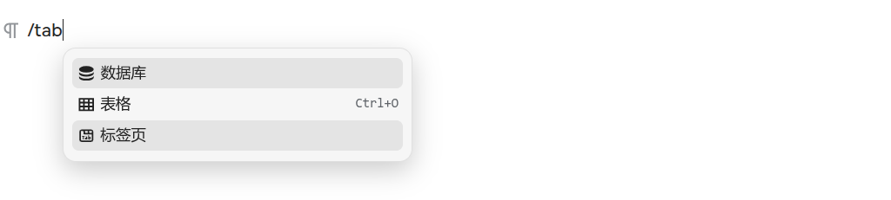
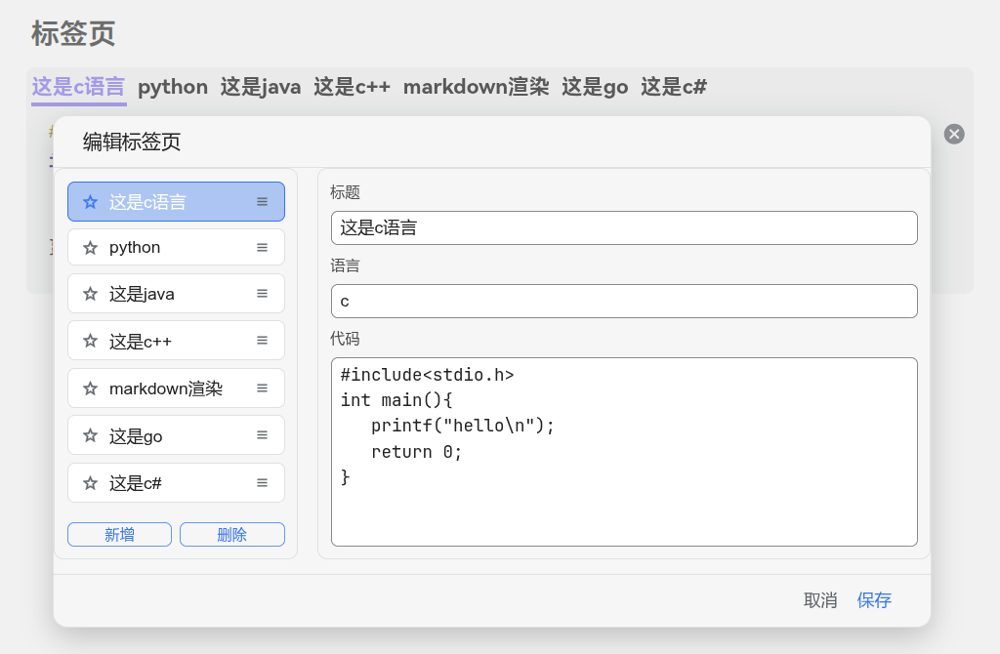

# Siyuan Code Tabs

[English](./README.md)

一个用于思源笔记的代码标签页插件，让多语言代码以标签页形式更清晰地组织与展示。

## 功能特性

- 多语言代码标签页展示，支持快捷编辑
- 标签页编辑面板：新增、删除、改名、改语言、改代码
- 支持设置默认标签与一键复制当前标签代码
- 批量操作：合并多个代码块、拆分标签页为代码块（块级/文档级/全局）
- 主题样式自定义与适配能力

## 兼容性

- **仅支持思源 3.5.0 及以上版本**
- 需要开启：设置 -> 编辑器 -> `允许执行HTML块内脚本`

## 快速开始

1. 通过斜杠菜单输入 `标签页` / `tab` / `bq` 插入默认标签页
2. 或选中多个代码块，通过块菜单 `块：合并选中代码块` 生成标签页
3. 点击标签页右上角 **编辑** 按钮打开编辑面板

## 使用说明

1. **编辑标签页**
   - 修改标题、语言、代码内容
   - 支持新增/删除标签
   - 语言为 `markdown-render` 时，使用思源内置 Lute 渲染，支持 KaTeX / Mermaid / Graphviz / PlantUML / ABC
2. **设为默认**
   - 点击右上角 **设为默认** 按钮，将当前标签设为默认展示
3. **复制**
   - 点击右上角 **复制** 按钮，一键复制当前标签代码
4. **更多操作（块菜单）**
   - `块：合并选中代码块`
   - `块：拆分标签页为代码块`
   - `文档：拆分标签页为代码块`
5. **设置面板（全局入口）**
   - `将所有代码标签页拆分为代码块`（用于弃用插件时方便还原）
   - `迁移旧标签页`（将旧版本标签页升级为新版本）

## 主题适配

- 若主题样式异常，可尝试：
  - 切换外观模式 / 主题
  - 关闭文档再重开
  - 重启思源
- 可通过自定义配置适配主题：
  - 路径：`SiYuan工作空间/data/plugins/code-tabs/custom/theme-adaption.yaml`
  - 仓库内参考：`/public/asset/theme-adaption.yaml`

## 数据说明

- 标签页原始数据以 Base64 形式存储在块自定义属性中
- 只要自定义属性未丢失，数据可恢复

## 已知问题

- 不保证适配所有第三方主题
- 导出为 markdown / HTML 时样式会丢失
- 仅导出 PDF/图片时可显示标签页样式，但无法切换标签

## 演示

## 备注

- 插件开发过程中使用了 AI 辅助
- 参考项目：[obsidian-code-tab](https://github.com/lazyloong/obsidian-code-tab)
- 测试思源版本：3.5.3

## 更新日志

### v2.0.1

- 修复块菜单在选区内操作时误选中全局标签页的问题

### v2.0.0

- 全新升级：不再使用代码块作为中转
- 新增编辑面板，支持直接新增与删除标签页

### v1.1.2

- 修复块菜单中二级子菜单消失的错误

### v1.1.1

- 修正插件在快捷键设置中的文本错误

### v1.1.0

- 新增“标签页 → 标准代码块”拆分功能（块级/文档级/全局入口）
- 新增“合并选中代码块”为 tab 语法代码块
- 块菜单新增“更多 [code-tabs]”子菜单，整理常用操作入口

### v1.0.0

- 重构主题样式采集与应用逻辑，现在切换主题时不再要求至少有一个打开着的文档了
- 新增行号显示与样式适配，现在打开代码块行号时标签页也会显示行号了
- 适配部分主题的代码块滚动条
- 部分样式优化

### v0.8.0

- 同步代码块换行及连字设置
- 新增 `markdown-render` 类型标签，现在可以通过切换语言 `markdown` / `markdown-render` 控制标签页中是否对 markdown 进行渲染
- 部分样式调整及优化

### v0.7.0

- **重大更新：语法格式变更** - 从旧的 `tab:::标题:::active` 和 `lang:::语言` 语法改为新的 `::: 标题 | 语言 | active` 语法
- 兼容旧语法，在从代码标签页还原回代码块时会自动将旧的语法格式更新为新的语法格式
- 添加主题适配文件，让用户可以自主适配第三方主题
- 实现代码块与代码标签页的双向批量转换功能
- 修改源码存储方式，改用Base64编码存储源码
- 更新依赖版本，代码高亮改用思源自带的hljs
- 添加设置项，将全局转换功能从块菜单移至设置面板
- 优化主题变动检测方法，修复DOM刷新问题
- 修复标签页和代码块宽度不一致的问题
- 修复尖括号丢失问题

### v0.6.2

- 修复3.1.15中切回代码块时换行符丢失的问题
- 修复某些主题中标签和代码间的间距问题

### v0.6.1

- 调整标签的最小宽度

### v0.6.0

- 现在复制按钮可以复制markdown了
- 移动端标签过多时可以左右滑动查看标签了
- 修复使用docker时复制按钮不生效的问题
- 优化标签样式

### v0.5.0

- 优化样式及显示效果，适配更多主题
- 修复在使用docker时可能因CORS问题导致的代码样式异常的问题
- 修复在某些版本中标签页内代码边距太小的问题

### v0.4.2

- 支持在docker中运行插件

### v0.4.1

- 加载插件时会检查是否打开了允许执行HTML块内脚本选项

### v0.4.0

- 修复尖括号转义问题
- 限制标签标题长度，标签过多时自动添加水平滚动条
- 调整纯文本和markdown中代码块的字体大小

### v0.3.0

- 优化显示效果
- 让标签页适配更多主题
- 现在可以指定打开文档时默认激活的标签了
- 修复了一些bug
