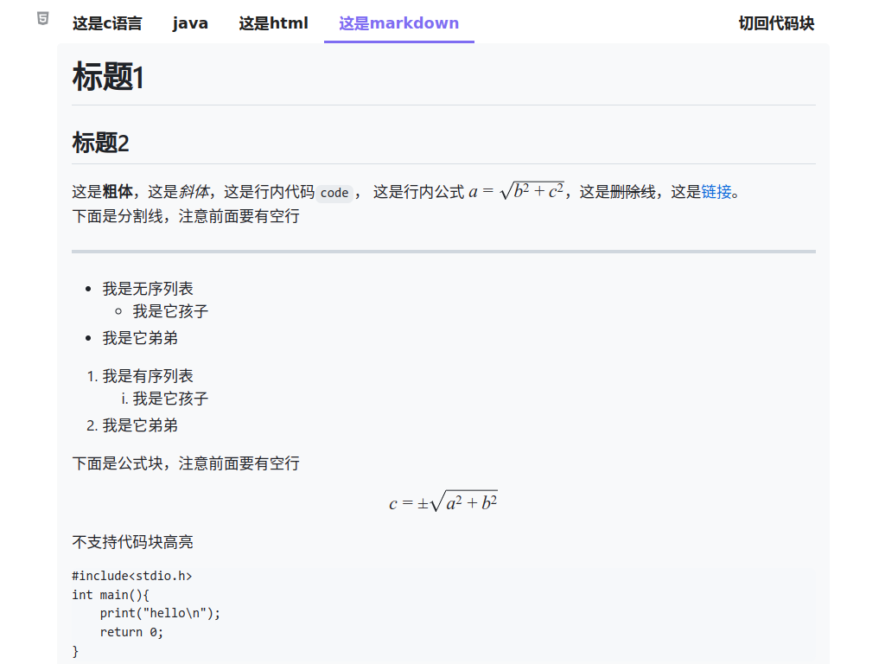

# Siyuan Code Tabs

[English](./README.md)
## 简介
这个思源插件允许你将多种语言的代码放在一组标签页下

## 已知问题
- 无法适配所有第三方主题
- 切换主题或模式时至少要有一个打开着的文档，否则标签页样式不会随主题改变，需要打开一个文档后再次切换主题
- 导出为markdown或html等格式时所有标签页样式会丢失，只有导出pdf或图片时标签页才能正常显示
- 少数情况下代码标签页的样式不会随主题和模式变化，这时请尝试以下方法：
  - 切换模式
  - 切换主题
  - 关闭已打开的文档再重新打开
  - 重启思源笔记后再次尝试以上方法
- ***代码中包含尖括号时显示出错的问题请等待思源发布新版本修复HTML块的内容转义问题，目前仅有思源3.0.14能正常使用，详情见[issue](https://github.com/siyuan-note/siyuan/issues/11499)***

## 提示
- 思源3.0.14及以上版本需要在 设置 -> 编辑器 中打开 `允许执行HTML块内脚本`
- 0.2.0版本与之前的版本不兼容，书写格式也有所改变，以前生成的代码标签页需要删除
- 0.3.0版本代码发生了重大变更，以前生成的代码标签页中的各个按钮可能不再生效，需使用鼠标点击 ***任意块***左上角的块菜单 -> 插件 -> 修复已打开文档中所有代码标签页 后方可正常使用
- 从0.3.0版本开始各项功能已基本实现预期(暂时不考虑实现显示行号功能)，之后的更新将主要以修复bug和优化样式为主

## 使用示例
1. 先在思源文档中插入一个代码块，形式如下。在`tab:::`后输入标题，之后再跟上`:::active`表示打开文档时默认激活这个标签，若没有添加该标志则默认激活第一个标签。之后再输入`lang:::语言`，其中`lang:::语言`省略不写时默认将标题作为代码的语言类型。[示例文件](./asset/example.md)  
   - 语言类型为`markdown`时会使用[marked](https://github.com/markedjs/marked)进行渲染，使用[marked-katex-extension](https://github.com/UziTech/marked-katex-extension)渲染[Katex](https://katex.org/)公式，使用[marked-highlight](https://github.com/markedjs/marked-highlight)渲染代码块。
   ```
   tab:::这是c语言:::active
   lang:::c
   #include<stdio.h>
   int main(){
      printf("hello\n");
      return 0;
   }
   
   tab:::这是python
   lang:::python
   def hello_world():
      print("Hello World")
   ```
2. 鼠标点击 代码块左上角的块菜单 -> 插件 -> 将代码块转换为标签页，你也可以在 设置 -> 快捷键 中为该功能设置一个快捷键。转换后效果如下  
   
   
   
3. 若需要编辑代码，可点击标签页右上角的 **切回代码块**，编辑完成之后再次将代码块转换为标签页即可
   
4. 可以点击右上角的复制按钮一键复制代码(只会复制纯文本)  
   

## 备注
- 这个插件基本上是在文心一言和ChatGPT的帮助下写出来的
- 这个插件是仿照[obsidian-code-tab](https://github.com/lazyloong/obsidian-code-tab)写的

## 更新日志
### v0.3.0
- 优化显示效果
- 让标签页适配更多主题
- 现在可以指定打开文档时默认激活的标签了
- 修复了一些bug