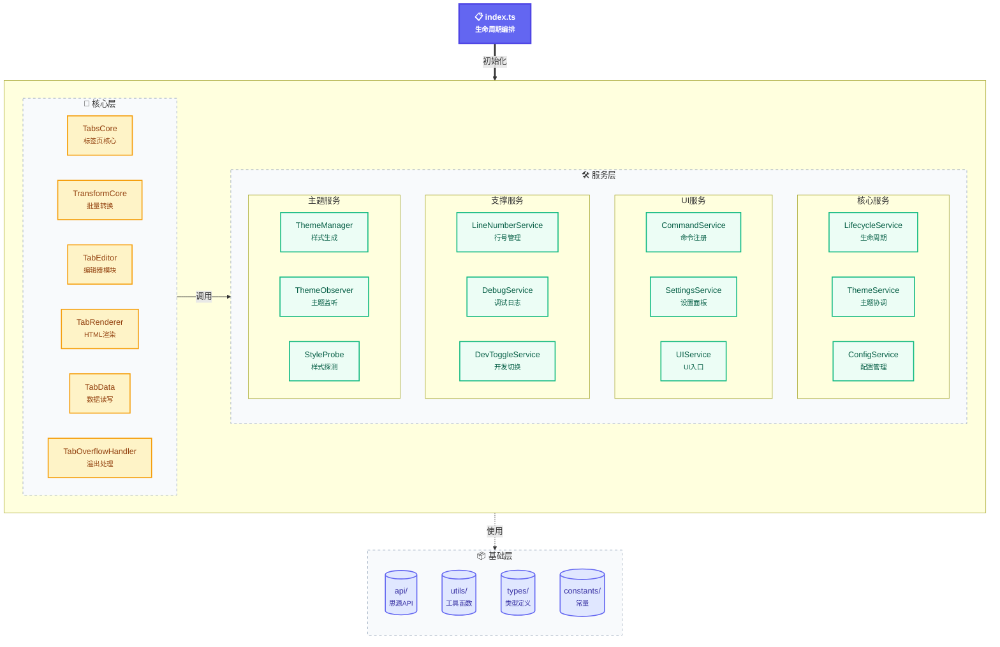

# Code Wiki: siyuan-code-tabs

## 项目概述

`code-tabs` 是一个思源笔记(SiYuan)插件，允许用户将多种语言的代码组织成可切换的标签页形式。该插件支持代码块与标签页之间的双向转换、主题样式自适应、行号显示等功能。

### 核心特性

- **Tabbed code blocks**: 支持多语言代码块在同一容器中切换
- **Tab editor panel**: 可视化添加、删除、重命名标签页
- **Default tab setting**: 可设置默认打开的标签页
- **Batch operations**: 支持合并代码块、拆分标签页
- **Theme adaptation**: 自动适配思源笔记主题样式

---

## 架构设计

### 整体架构图



### 架构设计原则

1. **三层架构**：
   - **核心层（Core）**：业务逻辑，可依赖工具性服务
   - **服务层（Services）**：协调服务与工具性服务
   - **基础层（Foundation）**：API、工具、类型、常量

2. **依赖规则**：
   - 核心层 → 服务层：仅限**工具性服务**（StyleProbe、LineNumberService）
   - 核心层 → 服务层：禁止依赖**协调性服务**（LifecycleService、ThemeService等）
   - 服务层 → 基础层：正常使用
   - 无循环依赖

3. **职责单一**：每个模块只负责一项核心功能

### 模块职责说明

| 模块 | 职责 | 文件位置 |
|------|------|----------|
| **TabsCore** | 标签页交互与全局函数 | `src/core/TabsCore.ts` |
| **TransformCore** | 批量转换（代码块↔标签页） | `src/core/TransformCore.ts` |
| **TabEditor** | 标签页编辑器主模块 | `src/core/TabEditor.ts` |
| **TabRenderer** | HTML渲染与代码高亮 | `src/core/TabRenderer.ts` |
| **TabData** | 数据编码解码与读写 | `src/core/TabData.ts` |
| **LifecycleService** | 生命周期管理（刷新+事件） | `src/services/LifecycleService.ts` |
| **ThemeService** | 主题协调（生成+监听+探测） | `src/services/ThemeService.ts` |
| **CommandService** | 命令注册与块菜单 | `src/services/CommandService.ts` |
| **ConfigService** | 配置加载与保存 | `src/services/ConfigService.ts` |
| **SettingsService** | 设置面板管理 | `src/services/SettingsService.ts` |
| **UIService** | UI入口（顶栏+斜杠菜单） | `src/services/UIService.ts` |
| **LineNumberService** | 行号扫描与管理 | `src/services/LineNumberService.ts` |
| **DebugService** | 调试日志管理 | `src/services/DebugService.ts` |

### 目录结构

```
src/
├── index.ts              # 入口：生命周期编排
├── core/                 # 核心层：业务逻辑
│   ├── TabsCore.ts       # 标签页交互核心
│   ├── TransformCore.ts  # 批量转换
│   ├── TabEditor.ts      # 编辑器主模块
│   ├── TabRenderer.ts    # HTML渲染
│   ├── TabData.ts # 数据读写服务
│   ├── TabOverflowHandler.ts # 溢出处理
│   └── edit-panel/      # 代码编辑器组件
│       ├── CodeEditorManager.ts  # 编辑器管理
│       ├── DragDropManager.ts    # 拖拽管理
│       ├── KeyboardNavigator.ts  # 键盘导航
│       ├── LanguageSuggest.ts    # 语言建议
│       └── TabListRenderer.ts    # 标签列表渲染
├── services/             # 服务层：协调服务
│   ├── LifecycleService.ts   # 生命周期服务
│   ├── ThemeService.ts       # 主题服务（协调层）
│   ├── ThemeManager.ts       # 主题样式管理
│   ├── ThemeObserver.ts      # 主题变更监听
│   ├── StyleProbe.ts         # 样式探针
│   ├── CommandService.ts     # 命令服务
│   ├── ConfigService.ts      # 配置服务
│   ├── SettingsService.ts    # 设置服务
│   ├── UIService.ts          # UI入口服务
│   ├── LineNumberService.ts  # 行号服务
│   ├── DebugService.ts       # 调试服务
│   └── DevToggleService.ts   # 开发者切换服务
├── api/                  # 思源API封装
│   ├── index.ts          # API汇总导出
│   ├── request.ts        # 基础请求方法
│   ├── block.ts          # 块操作API
│   ├── file.ts           # 文件操作API
│   ├── attr.ts           # 属性操作API
│   ├── sql.ts            # SQL查询API
│   ├── notebook.ts       # 笔记本API
│   ├── notification.ts   # 通知API
│   ├── template.ts       # 模板API
│   ├── system.ts         # 系统API
│   └── network.ts        # 网络API
├── utils/                # 通用工具函数
│   ├── common.ts         # 通用工具（防抖、延迟等）
│   ├── dom.ts            # DOM操作工具
│   ├── encoding.ts       # Base64编码解码
│   ├── env.ts            # 环境检测
│   ├── i18n.ts           # 国际化工具
│   ├── language.ts       # 语言相关工具
│   ├── logger.ts         # 日志工具
│   ├── network.ts        # 网络请求工具
│   └── LegacyTabParser.ts # 旧版标签解析
├── types/                # 类型定义
│   ├── index.ts          # 类型汇总导出
│   ├── tabs.ts           # 标签页相关类型
│   ├── theme.ts          # 主题相关类型
│   ├── services.ts       # 服务相关类型
│   ├── siyuan.ts         # 思源相关类型
│   └── vite-env.d.ts     # Vite环境类型
└── constants/            # 常量与模板
    ├── index.ts          # 常量汇总导出
    ├── keys.ts           # 属性键名常量
    ├── paths.ts          # 文件路径常量
    └── templates.ts      # HTML模板与SVG图标
```

---

## 核心类型定义

### Tabs 数据结构

```typescript
// src/types/tabs.ts

export type CodeTab = {
  title: string; // 标签标题
  language: string; // 代码语言
  code: string; // 代码内容
  isActive: boolean; // 是否为活动标签
};

export type TabDataItem = {
  title: string; // 标签标题
  lang: string; // 代码语言
  code: string; // 代码内容
};

export type TabsData = {
  version: number; // 数据版本号
  active: number; // 默认活动标签索引
  tabs: TabDataItem[]; // 标签数组
};
```

### 主题样式类型

```typescript
// src/types/theme.ts

export type ThemeStyle = {
  // 字体相关
  fontFamily: string;
  fontSize: string;
  lineHeight: string;
  color: string;

  // 边框与阴影
  border: string;
  borderLeft: string;
  borderRadius: string;
  boxShadow: string;

  // 内外边距
  blockPadding: string;
  blockMargin: string;

  // 背景色
  blockBg: string;
  protyleActionBg: string;
  hljsBg: string;

  // 代码高亮
  hljsPadding: string;
  hljsMargin: string;
  hljsBorderTop: string;
  hljsOverflowY: string;
  hljsMaxHeight: string;

  // 编辑区域
  editablePadding: string;

  // 头部区域
  protyleActionPosition: string;
  protyleActionBorderBottom: string;
};
```

---

## 核心模块详解

### 1. TabsCore（标签页交互核心）

**职责**：管理标签页的交互逻辑，注册全局函数供HTML块调用。

**核心方法**：

| 方法                  | 功能               | 参数               |
| --------------------- | ------------------ | ------------------ |
| `initGlobalFunctions` | 初始化全局交互函数 | `i18n`, `onReload` |
| `cleanup`             | 清理资源           | -                  |

**全局函数暴露**（挂载到 `window.pluginCodeTabs`）：

```typescript
const pluginCodeTabs = {
    codeBlockStyle: StyleProbe,      // 样式探针
    openTag: (evt) => { ... },       // 切换标签
    copyCode: async (evt) => { ... }, // 复制代码
    setDefault: async (evt) => { ... }, // 设置默认标签
    editTab: async (evt) => { ... }, // 打开编辑面板
    refreshEcharts: async (evt) => { ... }, // 刷新图表
    refreshOverflow: (root) => { ... }, // 刷新溢出状态
};
```

**位置**：`src/core/TabsCore.ts`

---

### 2. TabRenderer（HTML渲染器）

**职责**：生成标签页的HTML结构，处理代码高亮与第三方库渲染。

**核心方法**：

| 方法                  | 功能                  |
| --------------------- | --------------------- |
| `createProtyleHtml`   | 生成完整的tabs HTML块 |
| `ensureLibraryLoaded` | 确保第三方库已加载    |
| `renderMarkdown`      | Markdown内容二次渲染  |
| `renderMath`          | KaTeX公式渲染         |
| `renderMermaid`       | Mermaid图表渲染       |
| `renderCode`          | 代码高亮渲染          |
| `renderAbc`           | ABC五线谱渲染         |
| `renderPlantUML`      | PlantUML渲染          |
| `renderGraphviz`      | Graphviz渲染          |

**支持的第三方库**：

- `hljs` - 代码高亮
- `katex` - 数学公式
- `mermaid` - 流程图
- `ABCJS` - 五线谱
- `plantumlEncoder` - UML图
- `Viz` - Graphviz图

**位置**：`src/core/TabRenderer.ts`

---

### 3. TabData（数据服务）

**职责**：处理tabs数据的编码、解码、校验与迁移。

**核心方法**：

| 方法                | 功能                       |
| ------------------- | -------------------------- |
| `encode`            | 编码TabsData为Base64字符串 |
| `decode`            | 解码Base64字符串为TabsData |
| `validate`          | 校验数据结构               |
| `normalize`         | 规范化数据                 |
| `clone`             | 深拷贝数据                 |
| `createDefaultData` | 创建默认数据               |
| `fromCodeTabs`      | 从CodeTab数组创建数据      |
| `readFromElement`   | 从DOM元素读取              |
| `readFromAttrs`     | 从属性读取                 |
| `readFromBlock`     | 从块读取                   |
| `writeToBlock`      | 写入块属性                 |
| `upgradeFromLegacy` | 从旧版语法升级             |

**数据存储格式**：

- 使用Base64编码存储在块属性 `custom-code-tabs-data` 中
- 数据结构包含版本号，支持向后兼容

**位置**：`src/core/TabData.ts`

---

### 4. TransformCore（批量转换）

**职责**：处理代码块与标签页之间的批量转换操作。

**核心方法**：

| 方法                         | 功能                     |
| ---------------------------- | ------------------------ |
| `codeToTabsBatch`            | 批量将代码块转为标签页   |
| `codeToTabsInDocument`       | 当前文档代码块转标签页   |
| `tabsToCodeBlocksBatch`      | 批量将标签页拆分为代码块 |
| `tabsToCodeBlocksInDocument` | 当前文档标签页拆分       |
| `allTabsToCodeBlocks`        | 全局拆分所有标签页       |
| `mergeCodeBlocksToTabSyntax` | 合并多个代码块           |
| `newTabs`                    | 创建新的标签页块         |
| `countLegacyTabs`            | 统计旧版标签页数量       |
| `upgradeLegacyTabs`          | 升级旧版标签页           |
| `cancelCurrentTask`          | 取消当前批量任务         |

**转换流程**：

1. 收集待处理块
2. 解析/验证数据
3. 执行转换
4. 显示进度与结果

**位置**：`src/core/TransformCore.ts`

---

### 5. TabEditor（编辑面板）

**职责**：提供标签页的可视化编辑界面。

**功能特性**：

- 添加/删除标签页
- 编辑标题、语言、代码内容
- 设置默认标签页
- 拖拽排序标签页
- 语言输入联想

**位置**：`src/core/TabEditor.ts`

**编辑器子组件**：

| 组件 | 职责 | 位置 |
|------|------|------|
| CodeEditorManager | 编辑器状态管理 | `src/core/code-editor/CodeEditorManager.ts` |
| DragDropManager | 拖拽排序管理 | `src/core/code-editor/DragDropManager.ts` |
| KeyboardNavigator | 键盘导航 | `src/core/code-editor/KeyboardNavigator.ts` |
| LanguageSuggest | 语言输入建议 | `src/core/code-editor/LanguageSuggest.ts` |
| TabListRenderer | 标签列表渲染 | `src/core/code-editor/TabListRenderer.ts` |

---

### 6. ThemeService（主题服务）

**职责**：协调主题样式生成、变更监听与样式探测。

**核心方法**：

| 方法                   | 功能             |
| ---------------------- | ---------------- |
| `init`                 | 初始化主题服务   |
| `updateStyle`          | 更新样式文件     |
| `startObserver`        | 启动主题监听     |
| `stopObserver`         | 停止主题监听     |
| `cleanup`              | 清理资源         |

**协调的子模块**：

- **ThemeManager**：生成并管理主题样式文件
- **ThemeObserver**：监听主题变更并触发更新
- **StyleProbe**：从思源编辑器探测样式

**位置**：`src/services/ThemeService.ts`

---

### 7. ThemeManager（主题样式管理）

**职责**：生成并管理主题样式文件。

**核心方法**：

| 方法                   | 功能             |
| ---------------------- | ---------------- |
| `putStyleFile`         | 生成样式文件     |
| `invalidateStyleProbe` | 清理样式缓存     |
| `updateAllTabsStyle`   | 刷新现有tabs样式 |

**生成的样式文件**：

- `code-style.css` - 代码高亮样式
- `background.css` - 背景与布局样式
- `github-markdown.css` - Markdown渲染样式

**位置**：`src/services/ThemeManager.ts`

---

### 8. ThemeObserver（主题监听）

**职责**：监听主题变更并触发样式更新。

**监听的变更类型**：

| 变更类型          | 触发更新                          |
| ----------------- | --------------------------------- |
| `theme-mode`      | background + codeStyle + markdown |
| `theme-light`     | background + codeStyle            |
| `theme-dark`      | background + codeStyle            |
| `theme-link`      | background (强制重采样)           |
| `code-style-link` | codeStyle                         |
| `html-attrs`      | background                        |

**配置变更映射**：

| 配置键                                       | 触发更新                              |
| -------------------------------------------- | ------------------------------------- |
| `fontSize`                                   | background + lineNumbers (强制重采样) |
| `codeLigatures`                              | background                            |
| `codeLineWrap`                               | background + lineNumbers              |
| `codeSyntaxHighlightLineNum`                 | lineNumbers                           |
| `mode`                                       | background + codeStyle + markdown     |
| `themeLight` / `themeDark`                   | background + codeStyle                |
| `codeBlockThemeLight` / `codeBlockThemeDark` | codeStyle                             |

**位置**：`src/services/ThemeObserver.ts`

---

### 9. ConfigService（配置管理）

**职责**：管理插件配置的加载、合并与保存。

**核心方法**：

| 方法           | 功能               |
| -------------- | ------------------ |
| `loadAndApply` | 加载配置并应用样式 |
| `saveConfig`   | 保存配置到文件     |

**配置存储**：

- 文件路径：`data/plugins/code-tabs/custom/config.json`
- 包含配置版本号，支持版本升级
- 自动清理废弃的配置键

**位置**：`src/services/ConfigService.ts`

---

### 10. LifecycleService（生命周期服务）

**职责**：管理编辑器刷新与Protyle生命周期事件。

**核心方法**：

| 方法                    | 功能               |
| ----------------------- | ------------------ |
| `init`                  | 初始化服务         |
| `registerProtyleEvents` | 注册Protyle事件    |
| `unregisterProtyleEvents` | 注销Protyle事件  |
| `refreshEditors`        | 刷新编辑器         |
| `cleanup`               | 清理资源           |

**位置**：`src/services/LifecycleService.ts`

---

### 11. LineNumberService（行号服务）

**职责**：管理代码行号的显示与刷新。

**核心方法**：

| 方法            | 功能                   |
| --------------- | ---------------------- |
| `scanAll`       | 扫描所有tabs并添加行号 |
| `refreshAll`    | 刷新所有行号           |
| `refreshActive` | 刷新活动标签行号       |
| `cleanup`       | 清理所有行号           |
| `isEnabled`     | 检查是否启用行号       |

**位置**：`src/services/LineNumberService.ts`

---

## 插件生命周期

### onload 阶段

```typescript
async onload() {
    // 1. 初始化调试服务
    this.debugService = new DebugService();

    // 2. 初始化生命周期服务
    this.lifecycleService = new LifecycleService();

    // 3. 初始化核心模块
    TabsCore.initGlobalFunctions(i18n, onReload);

    // 4. 初始化服务层
    this.configService = new ConfigService();
    this.themeService = new ThemeService();
    this.commandService = new CommandService();
    this.uiService = new UIService();
    this.settingsService = new SettingsService();
    this.lineNumberService = new LineNumberService();

    // 5. 注册斜杠菜单
    this.uiService.registerSlashMenu();

    // 6. 注册命令
    this.commandService.register();
}
```

### onLayoutReady 阶段

```typescript
async onLayoutReady() {
    // 1. 初始化顶部按钮
    this.uiService.initTopBar();

    // 2. 同步思源配置
    syncSiyuanConfig(this.data);

    // 3. 加载配置并应用主题
    await this.configService.loadAndApply();

    // 4. 检查旧版标签页并提示升级
    await TransformCore.checkLegacyTabsPrompt();

    // 5. 启动主题监听
    this.themeService.startObserver();

    // 6. 注册Protyle事件
    this.lifecycleService.registerProtyleEvents();

    // 7. 扫描行号
    this.lineNumberService.scanAll();
}
```

### onunload 阶段

```typescript
onunload() {
    // 清理所有资源
    this.lifecycleService?.unregisterProtyleEvents();
    this.themeService?.stopObserver();
    TransformCore.cancelCurrentTask();
    this.lineNumberService?.cleanup();
    TabsCore.cleanup();
    StyleProbe.cleanup();
    this.debugService?.cleanup();

    // 删除全局对象
    if (window.pluginCodeTabs) {
        delete window.pluginCodeTabs;
    }
}
```

---

## API 封装层

`src/api/` 目录包含思源API的封装，每个文件对应一类API：

| 文件              | API分类      |
| ----------------- | ------------ |
| `request.ts`      | 基础请求方法 |
| `block.ts`        | 块操作API    |
| `file.ts`         | 文件操作API  |
| `attr.ts`         | 属性操作API  |
| `sql.ts`          | SQL查询API   |
| `notebook.ts`     | 笔记本API    |
| `notification.ts` | 通知API      |
| `template.ts`     | 模板API      |
| `system.ts`       | 系统API      |
| `network.ts`      | 网络API      |

**设计原则**：

- 严格一函数对应一个API
- 只做请求与类型约束
- 不掺杂业务逻辑

---

## 工具函数

`src/utils/` 目录包含通用工具函数：

| 文件               | 功能                         |
| ------------------ | ---------------------------- |
| `common.ts`        | 通用工具函数（防抖、延迟等） |
| `dom.ts`           | DOM操作工具                  |
| `encoding.ts`      | Base64编码解码               |
| `env.ts`           | 环境检测（移动端判断等）     |
| `i18n.ts`          | 国际化工具                   |
| `language.ts`      | 语言相关工具                 |
| `logger.ts`        | 日志工具                     |
| `network.ts`       | 网络请求工具                 |
| `LegacyTabParser.ts` | 旧版标签解析器             |

---

## 常量定义

`src/constants/` 目录包含项目常量：

| 文件           | 内容               |
| -------------- | ------------------ |
| `keys.ts`      | 属性键名、标识常量 |
| `paths.ts`     | 文件路径常量       |
| `templates.ts` | HTML模板与SVG图标  |
| `index.ts`     | 常量汇总导出       |

---

## 数据存储机制

### 属性存储

Tabs数据通过块属性存储：

```typescript
// src/constants/keys.ts
export const CODE_TABS_DATA_ATTR = "custom-code-tabs-data";

// 旧版数据格式（已废弃）
export const CUSTOM_ATTR = "custom";
```

### 数据编码流程

```
TabsData → JSON.stringify → Base64.encode → 存储到块属性
```

### 数据读取流程

```
块属性 → Base64.decode → JSON.parse → TabsData
```

---

## 主题适配机制

### 样式采集流程

1. **自动探测**：通过 `StyleProbe` 从思源编辑器采集样式
2. **外部配置**：读取 `theme-adaption.yaml` 配置文件
3. **优先级**：外部配置 > 自动探测

### 主题配置文件

路径：`data/plugins/code-tabs/custom/theme-adaption.yaml`

```yaml
version: "1.0"
themes:
  - id: "theme-id"
    name: "主题名称"
    fullStyle:
      fontFamily: "monospace"
      fontSize: "14px"
      # ... 其他样式属性
    extraCss: |
      .custom-class { /* 额外CSS */ }
```

---

## 依赖关系图

```
index.ts (入口)
    │
    ├── TabsCore (交互核心)
    │       ├── TabData (数据服务)
    │       ├── TabRenderer (渲染)
    │       ├── TabEditor (编辑器)
    │       └── StyleProbe (样式探针)
    │
    ├── TransformCore (转换核心)
    │       ├── TabData
    │       └── TabRenderer
    │
    ├── ThemeService (主题服务)
    │       ├── ThemeManager (主题管理)
    │       │       └── StyleProbe
    │       ├── ThemeObserver (主题监听)
    │       └── LineNumberService (行号服务)
    │
    ├── ConfigService (配置服务)
    │       └── ThemeService
    │
    ├── SettingsService (设置服务)
    │       ├── TransformCore
    │       └── ConfigService
    │
    ├── CommandService (命令服务)
    │       └── TransformCore
    │
    ├── UIService (UI服务)
    │       ├── TransformCore
    │       └── TabData
    │
    ├── LifecycleService (生命周期服务)
    │       └── 编辑器刷新逻辑
    │
    └── LineNumberService (行号服务)
            └── StyleProbe
```

---

## 注意事项

1. **兼容性**：要求思源笔记 3.5.0+
2. **安全设置**：需在设置中开启"允许HTML块内执行脚本"
3. **架构约束**：
   - 核心层可依赖工具性服务（StyleProbe、LineNumberService），禁止依赖协调性服务
   - 服务层（Services）不得相互循环依赖
   - 所有资源必须在 `onunload` 中清理
